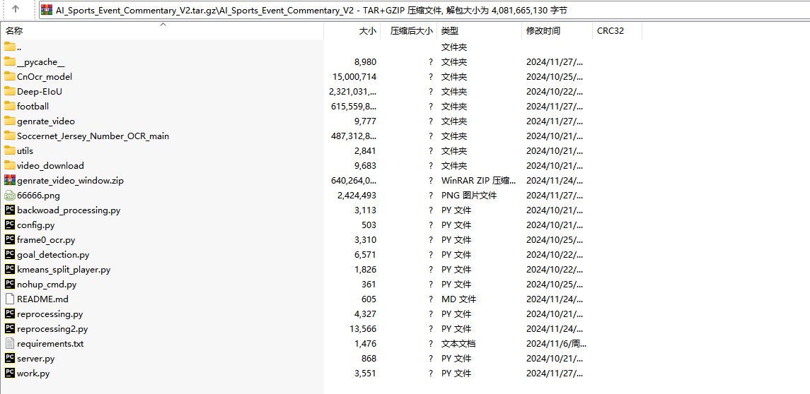
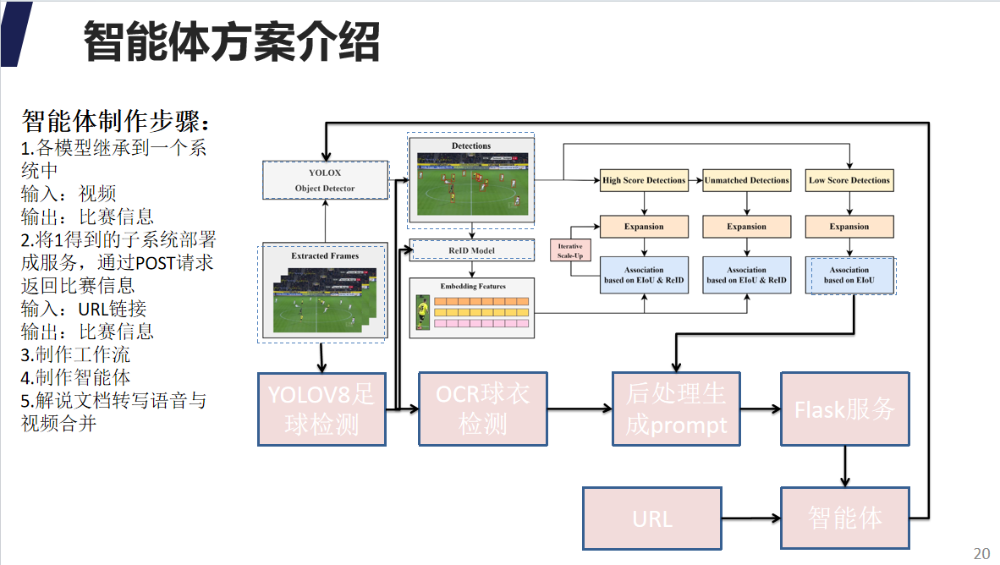
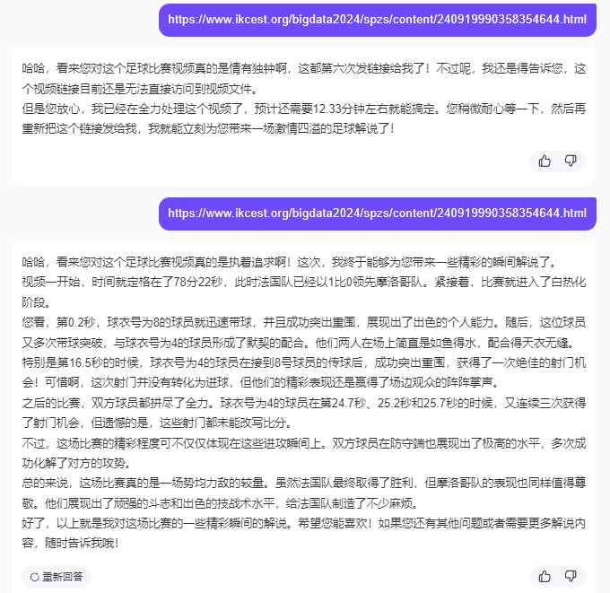
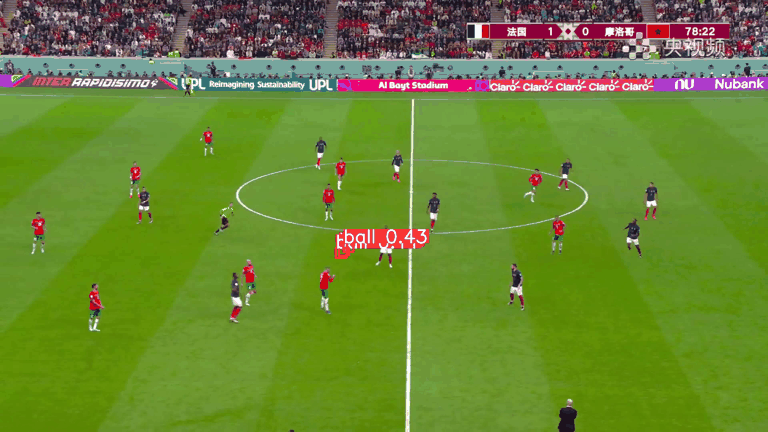
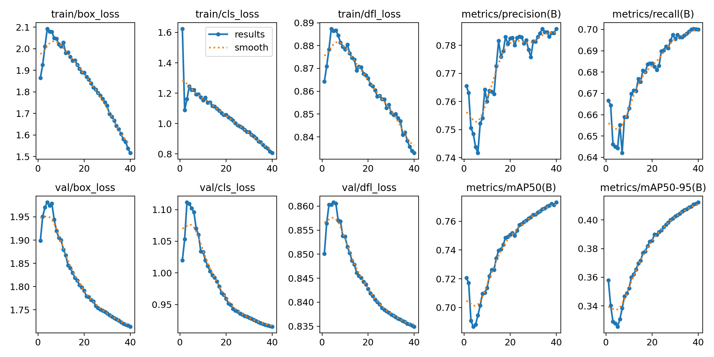

# AI体育赛事解说智能体

&nbsp;&nbsp;&nbsp;&nbsp;&nbsp;&nbsp;&nbsp;&nbsp;本项目是2024年IKCEST第六届“一带一路”国际大数据竞赛第8名方案，该赛题以“AI体育赛事解说”为题，通过以足球比赛视频为任务对象，借助视频处理、目标识别和跟踪、OCR、人体姿态、大语言模型等技术，将算法部署到文心智能体，生成足球赛事的AI解说。提出AI_SECS_Agent(Sports Event Commentary Sysyem)体育赛事解说系统，从全球452所高校的3997支队伍突颖而出。方案的主要流程是训练目标追踪、姿态识别、OCR模型、球门识别和球队识别模型，将其集成到一个系统中，通过向Agent下发足球赛事的URL，将追踪的结果信息和身份等信息作为prompt送入到LLM生成足球视频赛事解说。整个项目的内存为3.24G,包含了所有智能体的代码和模型：  
百度网盘：AI_Sports_Event_Commentary_V2.tar.gz  
链接: https://pan.baidu.com/s/1bePqKql77b3z71-tFhq1ng 提取码: waeu  
文件的目录结构为：

```
环境安装：
pip install -r requirements.txt
启动服务：
python server.py
启动完成后就可以使用POST的方法请求URL进行足球赛道的解说,当然这些prompt可以送给其他大语言模型LLM进行赛事的解说。
```
### 智能体结构图，智能体的制作流程详见 第8名-浩瀚星辰-答辩PPT（中文）.pptx
  

### 效果图
  

# YOLOV8足球检测模型训练及追踪


### 1. 目录结构
```
├─result                             结果文件
├─runs                               训练权重
│  └─detect
│      ├─track2
│      └─train14
│          └─weights
├─ultralytics                        yolov8源码 https://github.com/ultralytics/ultralytics
├─wandb                              训练log
├─yolov8_config                      训练配置文件
│  football_stact.py                 足球数据集制作脚本1
│  LICENSE
│  mp42gif.py                        
│  README.md
│  result.txt
│  split_dataset.py                  足球数据集制作脚本2
│  yolov8x.pt                        预训练模型
│  yolov8_predict.py                 足球视频追踪推理脚本
│  yolov8_predict_image.py           足球图片检测推理脚本
│  yolov8_train.py                   足球检测训练脚本
```
### 2.数据集的目录结构如下：
数据集制作参考1~3步骤：
https://blog.csdn.net/weixin_43509698/article/details/144570002  
IKCEST_Football数据集下载：  
百度网盘链接: https://pan.baidu.com/s/1upT_aD06lzjuz-Xjze0dcw 提取码: 6eax

```
IKCEST_Football
├─images
│  ├─train
│  │  ├─SNMOT-060_000001.jpg
│  │  ├─SNMOT-060_000002.jpg
│  │  ├─SNMOT-060_000003.jpg
│  │  ├─......
│  │
│  └─dev
│     ├─SNMOT-060_000009.jpg
│     ├─SNMOT-060_0000013.jpg
│     ├─SNMOT-060_0000014.jpg
│     ├─......
│
└─label
   ├─train
   │  ├─SNMOT-060_000001.txt
   │  ├─SNMOT-060_000002.txt
   │  ├─SNMOT-060_000003.txt
   │  ├─......
   │
   └─dev
      ├─SNMOT-060_000009.txt
      ├─SNMOT-060_000013.txt
      ├─SNMOT-060_000014.txt
      ├─......
```
### 3.训练足球检测模型
```commandline
python yolov8_train.py
```
### 4.足球视频追踪推理脚本
```commandline
python yolov8_predict.py
```
### 5.模型性能


