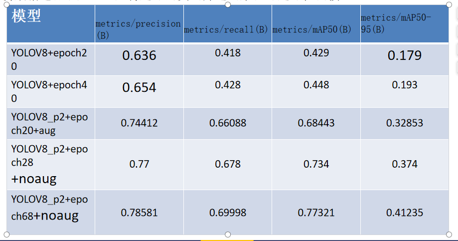

# YOLOV8足球检测模型训练及追踪


### 1. 目录结构
```
├─result                             结果文件
├─runs                               训练权重
│  └─detect
│      ├─track2
│      └─train14
│          └─weights
├─ultralytics                        yolov8源码 https://github.com/ultralytics/ultralytics
├─wandb                              训练log
├─yolov8_config                      训练配置文件
│  football_stact.py                 足球数据集制作脚本1
│  LICENSE
│  mp42gif.py                        
│  README.md
│  result.txt
│  split_dataset.py                  足球数据集制作脚本2
│  yolov8x.pt                        预训练模型
│  yolov8_predict.py                 足球视频追踪推理脚本
│  yolov8_predict_image.py           足球图片检测推理脚本
│  yolov8_train.py                   足球检测训练脚本
```
### 2.数据集的目录结构如下：
数据集制作参考1~3步骤：
https://blog.csdn.net/weixin_43509698/article/details/144570002  
IKCEST_Football数据集下载：  
百度网盘链接: https://pan.baidu.com/s/1upT_aD06lzjuz-Xjze0dcw 提取码: 6eax

```
IKCEST_Football
├─images
│  ├─train
│  │  ├─SNMOT-060_000001.jpg
│  │  ├─SNMOT-060_000002.jpg
│  │  ├─SNMOT-060_000003.jpg
│  │  ├─......
│  │
│  └─dev
│     ├─SNMOT-060_000009.jpg
│     ├─SNMOT-060_0000013.jpg
│     ├─SNMOT-060_0000014.jpg
│     ├─......
│
└─label
   ├─train
   │  ├─SNMOT-060_000001.txt
   │  ├─SNMOT-060_000002.txt
   │  ├─SNMOT-060_000003.txt
   │  ├─......
   │
   └─dev
      ├─10.txt
      ├─11.txt
      ├─12.txt
      ├─......
```
### 3.训练足球检测模型
```commandline
python yolov8_train.py
```
### 4.足球视频追踪推理脚本
```commandline
python yolov8_predict.py
```
### 5.模型性能


